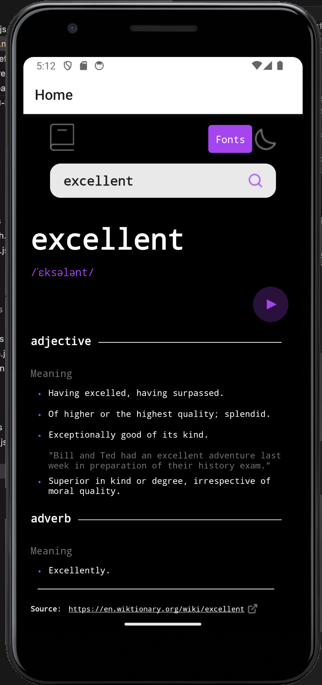
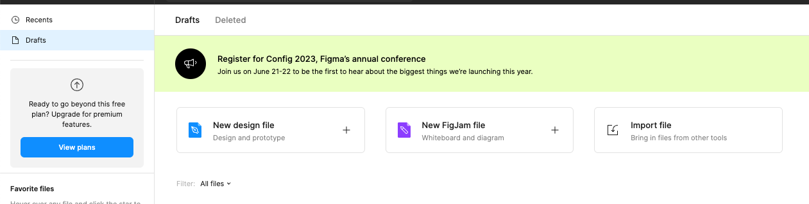

# Dictionary Search

Collaborators: Dima Melnik, Carter Garcia

## Design

You can also find the complete figma file of the design of the corresponding web application in `design/dictionary-web-app.fig`. To see the figma file, you will need to create an account at https://www.figma.com/, and load this given file in figma via “Import file”.

## Functionality

This application uses the Free Dictionary API: https://dictionaryapi.dev/. 

Users are able to:

* Search for words using the input field
* See the Free Dictionary API's response for the searched word
* See a form validation message when trying to submit a blank form
* Play the audio file for a word when it's available
* Switch between serif, sans serif, and monospace fonts
* Switch between light and dark themes
* View the optimal layout for the interface depending on their device's screen size
* See hover and focus states for all interactive elements on the page