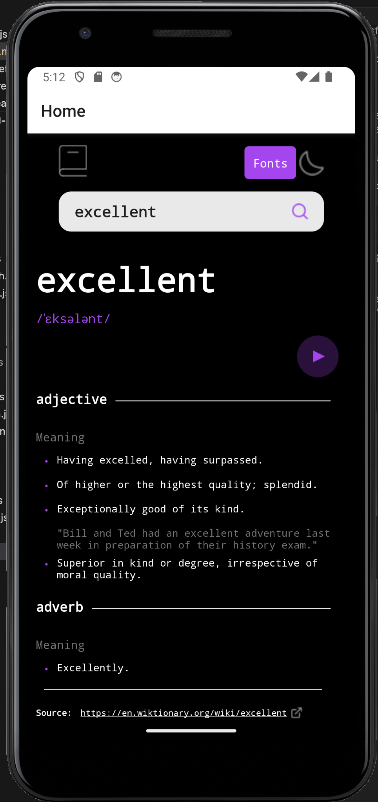
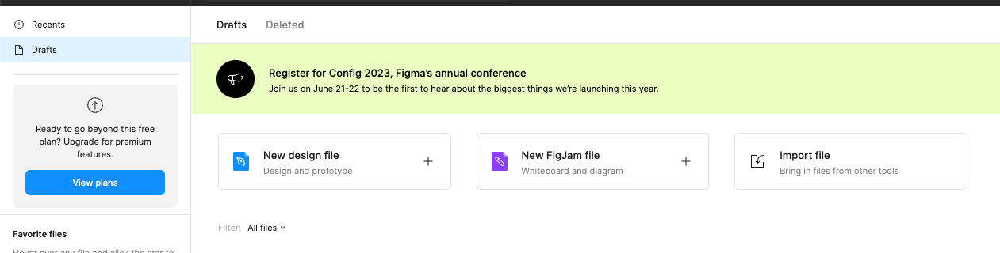

# Dictionary Search

Your name(s): Dima Melnik, Carter Garcia

## Getting Started

To run the application:

* Open the project in your chosen IDE used to develop and run Android apps
* Install dependencies using the following command: ```bash npm install```
* Then start the application on your chosen virtual device using ```bash npm start```

## Design



You can also find the complete figma file of the design of the corresponding web application in `design/dictionary-web-app.fig`. To see the figma file, you will need to create an account at https://www.figma.com/, and load this given file in figma via “Import file”.



The home screen loads a word and its definitions and pronunciation as a demo for users (e.g., keyword). In addition, there are two screens for users:

* One of those screens will be for users to change fonts (font selection)
* The other screen will be for users to change the theme (theme selection)

Users of your app are able to navigate freely among the three screens.

## Functionality

The application uses the Free Dictionary API: https://dictionaryapi.dev/.

Your users is able to:

* Search for words using the input field
* See the Free Dictionary API's response for the searched word
* See a form validation message when trying to submit a blank form
* Play the audio file for a word when it's available
* Switch between serif, sans serif, and monospace fonts
* Switch between light and dark themes
* View the optimal layout for the interface depending on their device's screen size
* See hover and focus states for all interactive elements on the page

Please note:

* The API will sometimes return multiple items for a word, phonetics, and audio file.


